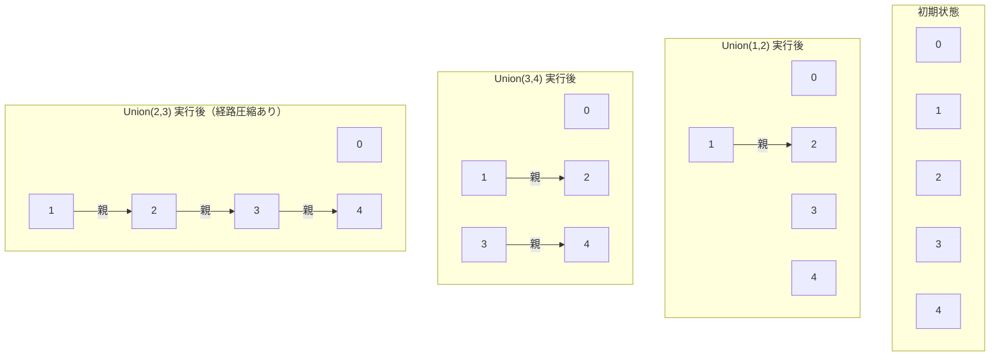

# Union-Find 木（Union-Find Tree）とは

Union-Find 木（または Disjoint Set Union, DSU、素集合データ構造）は、複数の要素をグループ（集合）に分けて管理し、グループの統合（Union）や所属判定（Find）を高速に行うためのデータ構造である。ノード間の連結関係が時間経過で変化するようなシステムを効率的に扱う際に役立つ。主にグラフの連結成分判定やクラスター管理、ネットワークの連結性判定などで利用される。集合の合併と所属判定をほぼ定数時間（アッカーマン関数の逆数オーダー）で実現できる。

- **連結成分**: グラフにおいて、違いに到達可能なノードの集合のこと。同じ連結成分内のどの二つのノードも、エッジを辿って違いに到達できる。
- **アッカーマン関数**: 極めてゆっくりと増加する関数であり、理論的には厳密な定数時間ではないものの、データ構造の性能評価においては、事実上の定数時間と見なすことができる。

## 2 つの基本操作

1. **所属判定(Find)**: 要素 x が含まれる集合のルートノードを返す。二つの要素 x, y が同じ集合（ルートノード）に属しているか（つまり、連結しているか）を判定するために用いられる。
2. **統合(Union)**: 要素 x を含む集合と要素 y を含む集合を併合し、一つの集合にする。

# Union-Find 木の構成要素の図解

## 基本的な Union-Find 木の例



# Union-Find 木の実装方法

通常、配列を用いて木構造として表現される。各要素はノードに対応し、配列の値はそのノードの親を指す。
集合の代表元は、自分自身を親とする根ノードである。

## ナイーブな実装

2 つの基本操作の実装は以下のようになる。

- **Quick Find (Eager Approach)**: Find 操作が$O(1)$になるように、同じ集合に属するすべての要素が同じ代表元を直接指すようにする。しかし、Union 操作では、一方の集合の全要素の代表元を書き換える必要があり、$O(n)$のコストがかかる。
- **Quick Union (Lazy Approach)**: Union 操作を高速化(O(1))するために、一方の木の根をもう一方の木の根の子とする。しかし、これにより木が線形に長く伸びてしまう可能性 があり、Find 操作が最悪の場合$O(n)$のコストを要す。

## ランクによる統合（Union by Rank/Size）を用いた最適化

Quick Union の性能劣化を防ぐための最適化が、ランク(またはサイズ)による統合( Weighted Quick Union)である。2 つの木を併合する際に、常に高さが低い木(ランクが小さい木)を高い木(ランクが大きい木)の根に接続する。木の高さの代わりに、含まれる要素数(サイズ)を基準にすることもできる。
これにより、木が不必要に高く成長することが抑制され、どのノードの深さも最悪でも$O(\log n)$に保たれることが保証される。

## パス圧縮(Path Conpression)を用いた最適化

もう一つの最適化がパス圧縮である。これは、Find(x)操作を実行する過程で、x から根までのパス上にあるすべてのノードを、直接根の子としてつなぎ替える。これにより、探索パスが平坦化され、それらのノード(およびその子ノード)に対する Find 操作が高速化される。

## 償却解析

Union-Find データ構造の最も注目すべき点は、これら 2 つの最適化(ランクによる統合とパス圧縮)を同時に用いた場合の性能である。単独ではそれぞれ$O(\log n)の改善しか保証しないが、組み合わせることで、各操作の償却時間計算量(一連の操作全体でならした平均時間)はO(\alpha(n))$となる。

ここで$\alpha(n)は∗∗逆アッカーマン関数∗∗であり、極めてゆっくりと増加する関数である。実用上考えられるいかなるnの値(例えば、宇宙の全原子数よりも大きい数)に対しても、 \alpha(n)$は 5 を超えることがない。したがって、このデータ構造の性能は、理論的には厳密な定数時間ではないものの、事実上、定数時間と見なすことができる。

「ランクによる統合」は、パス圧縮の効果を低下させる最悪ケース(線形に長い木)の発生を防ぎ、「パス圧縮」は、「ランクによる統合」によって適度にバランスが保たれた木をさらに平坦化し、探索を高速化する。これら 2 つの最適化 は、互いの弱点を補い合うことで、単独では到達不可能なレベルの効率性を実現している。

## Go による Union-Find 木の実装例

```go
package unionfind

// Union-Find構造体
type UnionFind struct {
    parent []int // 各要素の親
    size   []int // 各集合のサイズ
}

// n個の要素で初期化
func NewUnionFind(n int) *UnionFind {
    uf := &UnionFind{
        parent: make([]int, n),
        size:   make([]int, n),
    }
    for i := 0; i < n; i++ {
        uf.parent[i] = i
        uf.size[i] = 1
    }
    return uf
}

// 根を求める（経路圧縮あり）
func (uf *UnionFind) Find(x int) int {
    if uf.parent[x] != x {
        uf.parent[x] = uf.Find(uf.parent[x])
    }
    return uf.parent[x]
}

// 2つの集合を統合（ランク合併）
func (uf *UnionFind) Union(x, y int) {
    rx := uf.Find(x)
    ry := uf.Find(y)
    if rx == ry {
        return
    }
    // サイズが大きい方に小さい方をつなぐ
    if uf.size[rx] < uf.size[ry] {
        uf.parent[rx] = ry
        uf.size[ry] += uf.size[rx]
    } else {
        uf.parent[ry] = rx
        uf.size[rx] += uf.size[ry]
    }
}

// 同じ集合か判定
func (uf *UnionFind) Same(x, y int) bool {
    return uf.Find(x) == uf.Find(y)
}

// 集合のサイズを取得
func (uf *UnionFind) Size(x int) int {
    return uf.size[uf.Find(x)]
}

// 集合の代表（根）を取得
func (uf *UnionFind) Leader(x int) int {
    return uf.Find(x)
}

// すべての集合を取得（map[代表]要素リスト）
func (uf *UnionFind) AllGroups() map[int][]int {
    groups := make(map[int][]int)
    for i := range uf.parent {
        leader := uf.Find(i)
        groups[leader] = append(groups[leader], i)
    }
    return groups
}
```

## 最適化を利用した Go 実装

ランクによる統合とパス圧縮を両方用いた、慣用的な実装を示す。

```go
package main

// Disjoint Set Unionデータ構造を表す
type UnionFind struct {
    parent int
    rank int
    count int
}

// サイズ n の UnionFind 構造体を初期化する
func NewUnionFind(n int) *UnionFind {
    parent := make(int, n)
    rank := make(int, n)

    for i:=0; i<n; i++ {
        parent[i] = i
        rank[i] = 0
    }

    return &UnionFind{
        parent: parent,
        rank: rank,
        count: n,
    }
}

// 要素 p の属する集合の代表元を返す（パス圧縮機能付き）
func (f *UnionFind) Find(p int) int {
    if uf.parent[p] != p {
        uf.parent[p] = uf.Find(uf.parent[p]) // パス圧縮
    }

    return uf.parent[p]
}

// 要素 p と q の属する集合を併合する（ランクによる統合機能付き）
func (uf *UnionFind) Union(p, q int) {
    rootP := uf.Find(p)
    rootQ := uf.Find(q)

    if rootP == rootQ {
        return
    }

    // ランクによる統合
    if uf.rank[rootP] < uf.rank[rootQ] {
        uf.parent[rootP] = rootQ
    } else if uf.rank[rootP] > uf.rank[rootQ] {
        uf.parent[rootQ] = rootP
    } else {
        uf.parent[rootQ] = rootP
        uf.rank[rootP]++
    }
    uf.count--
}

// 現在の集合の数を返す
func (uf *UnionFind) Count() int {
    return uf.count
}
```

## Go ライブラリの利用

Go のライブラリとしては、github.com/theodesp/unionfind や
github.com/moorara/algo/unionfind などが存在し、特定のニーズに応じた実装を提供している。

### github.com/theodesp/unionfind

- `New(n int) *UnionFind` : n 個の要素で初期化
- `Union(x, y int)` : x と y の集合を統合
- `Find(x int) int` : x の属する集合の代表元を返す
- `Components() int` : 現在の集合数を返す

```go
package main

import (
    "fmt"
    "github.com/theodesp/unionfind"
)

func main() {
    n := 5
    uf := unionfind.New(n) // 要素数nで初期化

    uf.Union(0, 1) // 0と1を統合
    uf.Union(3, 4) // 3と4を統合
    uf.Union(1, 4) // 1と4を統合（0,1,3,4が同じ集合に）

    fmt.Println(uf.Find(0) == uf.Find(3)) // true
    fmt.Println(uf.Find(2) == uf.Find(3)) // false
    fmt.Println(uf.Components())          // 現在の集合数
}
```

### github.com/moorara/algo/unionfind

- `New(n int) *UnionFind` : n 個の要素で初期化
- `Union(x, y int)` : x と y の集合を統合
- `Find(x int) int` : x の属する集合の代表元を返す
- `Connected(x, y int) bool` : x と y が同じ集合か判定
- `Count() int` : 現在の集合数を返す

```go
package main

import (
    "fmt"
    "github.com/moorara/algo/unionfind"
)

func main() {
    n := 5
    uf := unionfind.New(n) // 要素数nで初期化

    uf.Union(0, 1) // 0と1を統合
    uf.Union(3, 4) // 3と4を統合
    uf.Union(1, 4) // 1と4を統合

    fmt.Println(uf.Connected(0, 3)) // true
    fmt.Println(uf.Connected(2, 3)) // false
    fmt.Println(uf.Count())         // 現在の集合数
}
```

# Union-Find 木の応用例

応用範囲は広く、特にグラフアルゴリズムで利用されることが多い。

- **グラフの連結成分の検出**: グラフの全ノードを独立した集合として用意する。各エッジ(u, v)に対して Union(u, v)を実行し、ノードの集合を作成。処理終了後に残っている集合の数が連結成分の数となる。
- **無向グラフにおけるサイクルの検出**: グラフのエッジを順に処理するとき、エッジ(u, v)を追加する前に Find(u)==Find(v)を確認する。真であれば、u と v は既に連結していることを意味する。エッジ(u, v)を追加するとサイクルが形成されることがわかる。
- **Kruskal の最小全域木アルゴリズム**: 辺の重みが小さい順にグラフに追加する場合、上記の手法を用いてサイクルが形成されない辺のみを選択するために Union-Find が利用される。
- **クラスタリングと画像セグメンテーション**: 各データ点や画素をノードとみなし、類似度（距離や色の近さ）に基づいて Union 操作を行うことで、データ点や画素をクラスタや領域に効率的にグループ分けすることができる。
